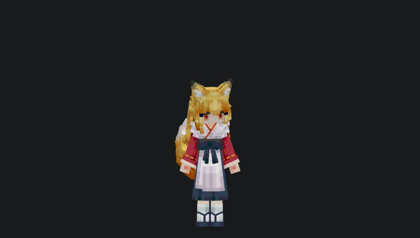
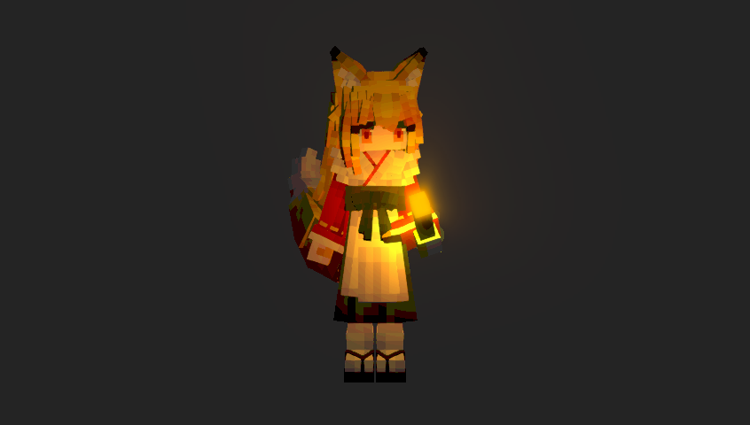

# wine-fox

[简体中文](../README.md) | [English](README_EN.md)



## Installation

`wine-fox` depends on [three](https://www.npmjs.com/package/three) and [lodash](https://www.npmjs.com/package/lodash) (optional, used in some examples).

```bash
pnpm install three lodash wine-fox
# If you need TypeScript support
pnpm install -D @types/three @types/lodash
```

## Usage

- For detailed API usage, please refer to the type definition files.
- Note: The API may change at any time. Please keep an eye on project updates.

- First, create a wine-fox instance

```JavaScript
// This only initializes the scene; model resources are not loaded yet
const model = new KanbanGirl(document.querySelector('#container'));
```

- Import and load the model

```JavaScript
import { urls } from 'wine-fox/assets';
await model.load(urls);
```

- Next, you can render the scene. You may want to limit the animation frame rate to save performance

```JavaScript
import { withFrameRateLimit } from 'wine-fox/tools';

const limit = withFrameRateLimit(60)(() => {
    // This callback will be executed at 60 FPS
});

limit.start();
```

- If you need a lower frame rate

```JavaScript
const limit = withFrameRateLimit(30)(() => {});
```

- If you don't need to limit the frame rate

```JavaScript
const limit = withFrameRateLimit(-1)(() => {});
// If you don't need frame rate limiting, using requestAnimationFrame directly is a better choice
```

- Before rendering, you need `THREE.Clock` to ensure the model maintains consistent speed at different frame rates

```JavaScript
import * as THREE from 'three';
const clock = new THREE.Clock();
```

- Start rendering

```JavaScript
const clock = new THREE.Clock();

const limit = withFrameRateLimit(60)(() => {
    model.update(clock.getDelta());
});

limit.start();
```

- If you want the `wine-fox` to look at the mouse position

```JavaScript
const mouse = {
    x: 0,
    y: 0,
};

const onMouseMove = (e) => {
    mouse.x = e.screenX
    mouse.y = e.screenY
};

window.addEventListener('mousemove', onMouseMove);

const limit = withFrameRateLimit(60)(() => {
    model.update(clock.getDelta());
    // Set here
    model.lookAt(mouse);
});
```

- To support dark mode, you can do this

```JavaScript
const model = new KanbanGirl(document.querySelector('#container'));
const isDarkMode = true;

function toggleDarkMode() {
  isDarkMode = !isDarkMode
  model?.setTheme(isDarkMode.value ? 'dark' : 'light')
}
```



### Usage in Vanilla JS

See example:

[examples/vanilla-project/src/main.ts](../../examples/vanilla-project/src/main.ts)

### Usage in Vue Project

See example:

[examples/vue-project/src/App.vue](../../examples/vue-project/src/App.vue)

## License

The code that drives `wine-fox` is licensed under the [MIT license](https://opensource.org/licenses/MIT).
The `wine-fox` model is licensed under [CC BY-NC-SA 4.0](https://creativecommons.org/licenses/by-nc-sa/4.0/deed.en), and comes from [Yes Steve Model](https://modrinth.com/mod/yes-steve-model).

---

If you have any questions or suggestions, feel free to submit an issue or PR.
